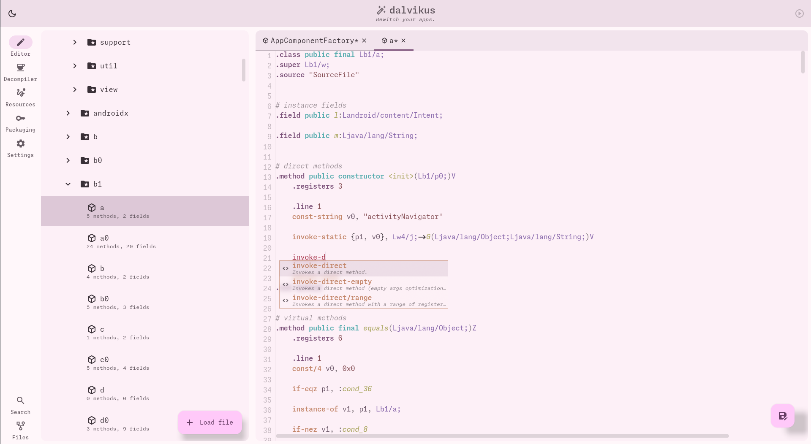
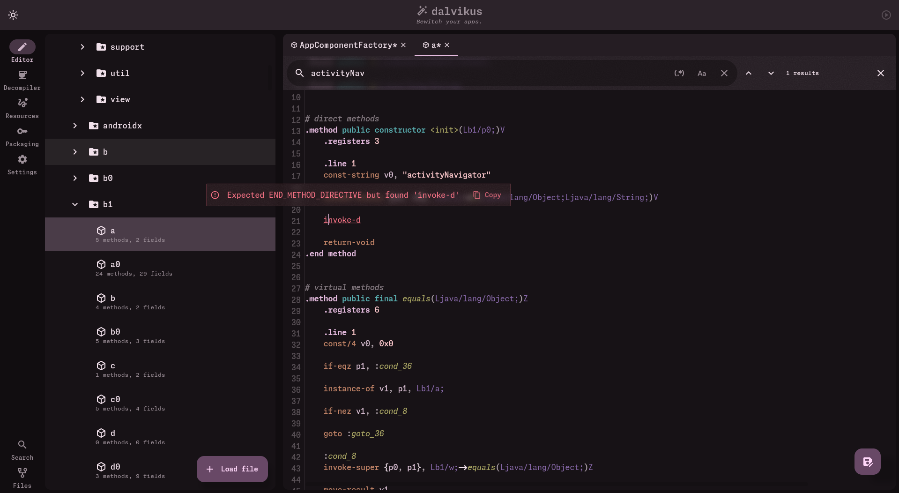
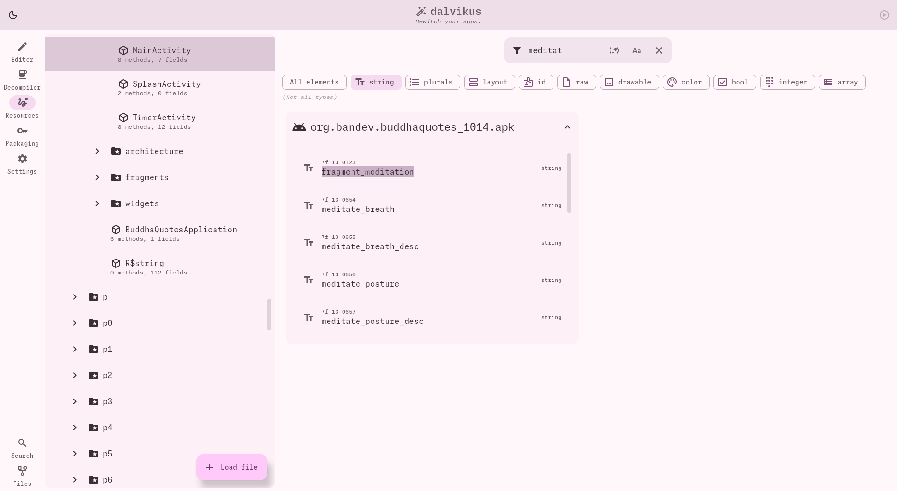
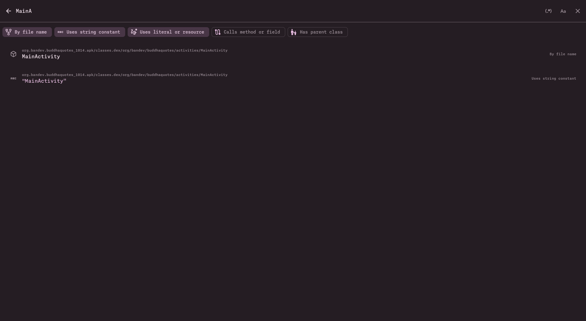

<a href="https://github.com/loerting/dalvikus">
    
</a>

# dalvikus [](https://github.com/loerting/dalvikus/releases) [](https://github.com/loerting/dalvikus/releases) [](https://www.jetbrains.com/compose-multiplatform/)

**Dalvikus** is a modern Android reverse engineering and modification toolkit built with [Compose Multiplatform](https://www.jetbrains.com/lp/compose-multiplatform/).  
Designed for developers and researchers who want to inspect, edit, and rebuild Android apps seamlessly.

> [!NOTE]
> With great power comes great responsibility. Dalvikus is intended **ONLY** for ethical purposes.

## Screenshots

<table>
  <tr>
    <td align="center"><br/><sub>Smali editor with code completion.</sub></td>
    <td align="center"><br/><sub>Comfortable dark theme and readable error messages.</sub></td>
  </tr>
  <tr>
    <td align="center"><br/><sub>Seamless live decompiler integration.</sub></td>
    <td align="center"><br/><sub>Sign and deploy edited applications directly.</sub></td>
  </tr>
  <tr>
    <td align="center"><br/><sub>Browse app resources.</sub></td>
    <td align="center"><br/><sub>Search literals, strings, references or names.</sub></td>
  </tr>
</table>

*Note: These might be subject to change as the project evolves.*

## Features

- Open APK and DEX files, allowing direct editing of DEX files inside APKs **without unpacking manually**
- Rich and comfortable smali language editor with **syntax highlighting**
- Assist popup for **code completion** while typing
- Light and dark themes for comfortable editing
- Support for **multiple decompilers** to analyze dalvik code
- Integrated app signing using **apksig** and **zipalign** for re-signing modified APKs
- Built-in **ADB runner** to deploy and start apps on connected devices directly
- Powerful search tools: **tree view, string constants, method and field references**
- Browse resource IDs, XML files, and more using integrated **apktool**

## Getting Started

### Requirements

- JDK 11 or higher
- Android SDK (build-tools and platform-tools, ADB and APK signing features)
- Supported OS: Windows, Linux, macOS

### Installation

Download the latest release from [Releases](https://github.com/loerting/dalvikus/releases) and follow the instructions for your platform.

Or build from source:

```bash
git clone https://github.com/loerting/dalvikus.git
cd dalvikus
./gradlew :composeApp:run
```

## License

This project is licensed under the GNU General Public License v3.0. See the [LICENSE](LICENSE) file for details.